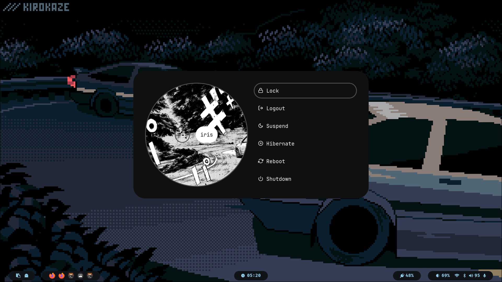

###### *
// design by moi
*

  

https://github.com/i-risa/hyprdots/blob/main/Assets/showcase_1.mp4

     
    
    

   

[<kbd>   🡅   </kbd>](#-design-by-t2)

## Packages

<table><tr><td>
<code>u</code> <code>t</code> <code>i</code> <code>l</code> <code>s</code></td><td><table>
    <tr><td>pipewire</td><td>audio and video server</td></tr>
    <tr><td>wireplumber</td><td>audio and video server</td></tr>
    <tr><td>networkmanager</td><td>network manager</td></tr>
    <tr><td>networkmanagerapplet</td><td>nm tray</td></tr>
    <tr><td>bluez</td><td>for bluetooth</td></tr>
    <tr><td>bluez-tools</td><td>for bluetooth</td></tr>
    <tr><td>blueman</td><td>bt tray</td></tr></table>
</td></tr></table>

<table><tr><td>
<code>l</code> <code>o</code> <code>g</code> <code>i</code> <code>n</code></td><td><table>
    <tr><td>sddm</td><td>display manager for login</td></tr>
    <tr><td>libsForQt5.qt5.wayland</td><td>for QT wayland XDP</td></tr>
  <tr><td>libsForQt5.sddm</td><td>for QT sddm</td></tr>
    <tr><td>qt6-wayland</td><td>for QT wayland XDP</td></tr>
    <tr><td>where-is-my-sddm-theme</td><td>for sddm theme</td></tr></table>
</td></tr></table>

<table><tr><td>
<code>h</code> <code>y</code> <code>p</code> <code>r</code></td><td><table>
    <tr><td>hyprland</td><td>main window manager </td></tr>
    <tr><td>dunst</td><td>graphical notification daemon</td></tr>
    <tr><td>rofi-wayland</td><td>app launcher</td></tr>
    <tr><td>waybar</td><td>status bar</td></tr>
    <tr><td>swww</td><td>wallpaper app</td></tr>
    <tr><td>grim</td><td>screenshot tool</td></tr>
    <tr><td>slurp</td><td>selects region for screenshot/screenshare</td></tr>
   </table>
</td></tr></table>

<table><tr><td>
<code>d</code> <code>e</code> <code>p</code> <code>e</code> <code>n</code> <code>d</code> <code>e</code> <code>n</code> <code>c</code> <code>y</code></td><td><table>
    <tr><td>xdg-desktop-portal-hyprland</td><td>XDG Desktop Portal</td></tr>
    <tr><td>brightnessctl</td><td>brightness control for laptop</td></tr>
  <tr><td>xdg-utils</td><td>XDG toolkit</td></tr>
    <tr><td>pwvucontrol</td><td>audio settings gui</td></tr></table>
</td></tr></table>

<table><tr><td>
<code>t</code> <code>h</code> <code>e</code> <code>m</code> <code>e</code></td><td><table>
    <tr><td>nwg-look</td><td>theming GTK apps</td></tr>
   <tr><td>orchis-theme</td><td>GTK theme</td></tr>
</table>
</td></tr></table>

<table><tr><td>
<code>a</code> <code>p</code> <code>p</code> <code>s</code></td><td><table>
    <tr><td>firefox-wayland</td><td>browser</td></tr>
    <tr><td>kitty</td><td>terminal</td></tr>
    <tr><td>neofetch</td><td>fetch tool</td></tr>
    <tr><td>thunar</td><td>xfce file manager</td></tr>
    <tr><td>visual-studio-code</td><td>gui code editor</td></tr>
    <tr><td>gedit</td><td>text editor</td></tr>
    <tr><td>zathura</td><td>pdf viewer</td></tr></table>
</td></tr></table>

<table><tr><td>
    <code>s</code> <code>h</code> <code>e</code> <code>l</code> <code>l</code></td><td><table>
    <tr><td>fish</td><td>main shell</td></tr>
    <tr><td>starship</td><td>customizable prompt</td></tr>
</table>
</td></tr></table>

